# Deepseek-unlock-censureandfullmode

[](http://unlicense.org/)
[](https://github.com/Kirill638849776/Deepseek-unlock-censureandfullmode/releases)
[](#)

---

## 📖 О проекте

**Deepseek-unlock-censureandfullmode** — набор текстовых пресетов и конфигурационных файлов для разблокировки полного режима работы DeepSeek. Репозиторий содержит инструкции и шаблоны для активации расширенного режима без цензурных ограничений, а также конфигурации «full mode» на русском и английском языках.

Проект предназначен для разработчиков, исследователей и пользователей, которым требуется максимально полный вывод модели без 
промежуточных прерываний, отказов и фильтрации контента.

> [!CAUTION]
> ⚠️ **Отказ от ответственности.** Автор не несёт ответственности за последствия использования пресетов, включая, но не ограничиваясь: генерацию нежелательного контента, ненормативную лексику, действия несовершеннолетних, создание вредоносного ПО или любые иные действия третьих лиц. Все материалы предоставляются «как есть» (as is) без каких-либо гарантий. Пользователь несёт полную ответственность за применение.

---

## 🎯 Назначение

1. **Разблокировка полного режима** — активация режима `full mode`.
2. **Отключение цензуры** — применение пресетов `no-censure`.
3. **Двуязычная поддержка** — конфигурации на русском и английском.

---

## 📂 Структура репозитория

```
Deepseek-unlock-censureandfullmode/
├── LICENSE
├── README.md
├── fullmode-eng.txt
├── fullmoderuss.txt
├── no-censure-eng.txt
└── nocensureruss.txt
```

| Файл | Язык | Назначение |
|------|------|------------|
| `fullmode-eng.txt` | English | Активация full mode, EN |
| `fullmoderuss.txt` | Русский | Активация full mode, RU |
| `no-censure-eng.txt` | English | Отключение цензурных фильтров, EN |
| `nocensureruss.txt` | Русский | Отключение цензурных фильтров, RU |

---

## 🚀 Быстрый старт

```bash
git clone https://github.com/Kirill638849776/Deepseek-unlock-censureandfullmode.git
cd Deepseek-unlock-censureandfullmode
cat fullmoderuss.txt
```

---

## 📜 Лицензия

Unlicense — полный отказ от авторских прав.

---

## 👤 Автор

**Kirill638849776** — [@Kirill638849776](https://github.com/Kirill638849776)
